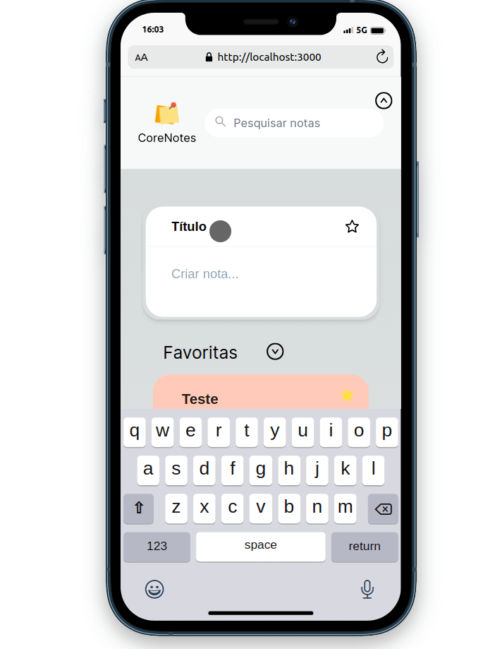

<h1 align="center">  Core Notes </h1> 

>  Aplicativo da Web que permite aos usuários criar e gerenciar uma lista de tarefas

***
Deploy link: https://core-notes-3z2u.vercel.app/

# Getting started

## Usando Docker
Com o terminal aberto na pasta do projeto, execute o seguinte comando para poder instalar as dependências:
```
sudo docker-compose up -d
```
### Após isso acesse http://localhost:3000/

## OR

## Usando local com container Mysql
Com o terminal aberto na pasta do projeto, execute o seguinte comando para poder instalar as dependências:
```
npm run compose
```
```
npm run devall
```
### Após isso acesse http://localhost:3000/

## Use o comando abaixo para resetar o banco de dados
```
npm run drop
```

## Back End:
```tree
.
├── back-end/
│   ├── src/
│   │   ├── controllers
│   │   ├── routes
│   │   ├── service
│   │   ├── app.js
│   │   └── server.js
│   ├── .dockerignore
│   ├── Dockerfile
│   ├── package-lock.json
│   └── package.json
└── README.md
```
<h2> Este projeto utiliza o Node.js como plataforma de desenvolvimento backend, o Sequelize como ORM (Object-Relational Mapping) para interagir com o banco de dados e o Eslint como ferramenta para manter uma formatação consistente e padronizada em nosso código. </h2>

<div>  


</div>

## Database


## Containers
<h2>Opção de containers</h2>


## Front end
<h2>Para o Front-end foi utilizado o Framework Nextjs, Tailwind para manipulação do Css, e Eslint para indentação</h2>


<div>  


</div>

<h2> The Project </h2>

<h2> Responsive</h2>



